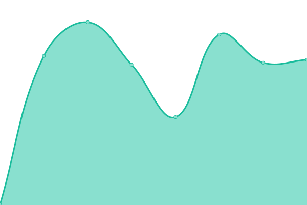
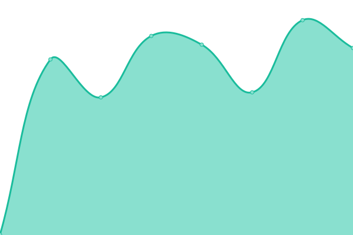

# [📈 Live Status](https://status.annaaurora.eu): <!--live status--> **🟩 All systems operational**

This repository contains the open-source uptime monitor and status page for [Anna Aurora](https://annaaurora.eu/), powered by [Upptime](https://github.com/upptime/upptime).

With [Upptime](https://upptime.js.org), you can get your own unlimited and free uptime monitor and status page, powered entirely by a GitHub repository. We use [Issues](https://github.com/auroraanna/upptime/issues) as incident reports, [Actions](https://github.com/auroraanna/upptime/actions) as uptime monitors, and [Pages](https://status.annaaurora.eu) for the status page.

<!--start: status pages-->
<!-- This summary is generated by Upptime (https://github.com/upptime/upptime) -->
<!-- Do not edit this manually, your changes will be overwritten -->
<!-- prettier-ignore -->
| URL | Status | History | Response Time | Uptime |
| --- | ------ | ------- | ------------- | ------ |
|  [aaura-w3-strawb](https://annaaurora.eu) | 🟩 Up | [aaura-w3-strawb.yml](https://github.com/auroraanna/upptime/commits/HEAD/history/aaura-w3-strawb.yml) | 

 511ms
     
 | 

<a href="https://status.annaaurora.eu/history/aaura-w3-strawb">100.00%</a>
    

|  [meme-bingo-web](https://bingo.annaaurora.eu) | 🟩 Up | [meme-bingo-web.yml](https://github.com/auroraanna/upptime/commits/HEAD/history/meme-bingo-web.yml) | 

 525ms
     
 | 

<a href="https://status.annaaurora.eu/history/meme-bingo-web">100.00%</a>
    

|  [kaufkauflist](https://kaufkauflist.annaaurora.eu) | 🟩 Up | [kaufkauflist.yml](https://github.com/auroraanna/upptime/commits/HEAD/history/kaufkauflist.yml) | 

 572ms
     
 | 

<a href="https://status.annaaurora.eu/history/kaufkauflist">100.00%</a>
    

|  [WKD](https://openpgpkey.annaaurora.eu/.well-known/openpgpkey/annaaurora.eu/hu/fxy63pyohfbm34b533z1nk4bhfhbkpsh) | 🟩 Up | [wkd.yml](https://github.com/auroraanna/upptime/commits/HEAD/history/wkd.yml) | 

 530ms
     
 | 

<a href="https://status.annaaurora.eu/history/wkd">100.00%</a>
    

|  [Find Billy!](https://find-billy.annaaurora.eu) | 🟩 Up | [find-billy.yml](https://github.com/auroraanna/upptime/commits/HEAD/history/find-billy.yml) | 

 514ms
     
 | 

<a href="https://status.annaaurora.eu/history/find-billy">100.00%</a>
    

<!--end: status pages-->

[**Visit our status website →**](https://status.annaaurora.eu)

## 📄 License

- Powered by: [Upptime](https://github.com/upptime/upptime)
- Code: [MIT](./LICENSE) © [Anand Chowdhary](https://anandchowdhary.com), supported by [Pabio](https://pabio.com)
- Data in the `./history` directory: [Open Database License](https://opendatacommons.org/licenses/odbl/1-0/)
